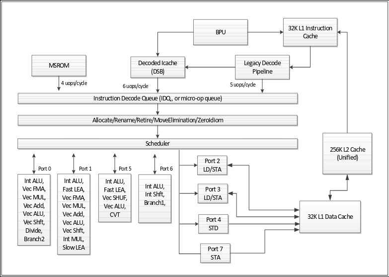

# Unison x86 resource model
Introduction
============
Work done by Jacob Kimblad during my time as a student intern on the Unison compiler reasearch project. The goal was to produce a valid resource model for X86-architectures used by Unison during instruction selection and instruction scheduling.

The work resulted in a complete resource model based on LLVM 6.0.0 and an incomplete resource model based on the works of Agner Fog.

The Skylake microarchitecture
-----------------------------
Here follows a short introduction to the skylake microarchitecture as the resource model is based on its hardware.

It is important to note that instructions is split up into so called micro-operations inside the Instruction Decode Queue (IDQ), which can hold 64 micro-operations to be scheduled. Different micro-operations are issued to different ports in the processor in parallel. 

The idea of a resource model is to model ports in the processor as resources that are used by micro-operations. For this information is needed about what micro-operations each instruction is broken down into, which ports these micro-operations are issued to, how long after the instruction has been issued its result is ready (latency), and how long after a micro-operation has been issued to a specific port, that port is ready for a new micro-operation (throughput).

Some micro-operations can be issued to several different ports. For example, micro-operations that make use of an integer ALU can be issued to ports 0, 1, 5, and 6 since therer is a total of 4 integer ALU's spread across 4 different ports. This also means that four micro-operations using an ALU can be issued each cycle.

Resource model based on LLVM 6.0.0
==================================
This resource model is currently based on the llvm 6.0.0 resource model for the Intel Skylake processor (6th generation Intel).

Each instruction is mapped to a "ResourceGroup" which can be thought of as an itinerary. Several instructions can share the same resource group, and the resource group holds information about the instructions resource usage. Each resource group contains the following information:

* Latency
* Resources
* ResourceCycles

Latency defines the duration between issuing the instruction until when its results are ready for use. 
Resources and ResourceCycles are lists of equal length, where Resources is a list of strings that defines resources used by the instruction, and ResourceCycles is a list of integers that define how many cycles each corresponding resource is used for. Resources used by a single instruction are modeled in LLVM to be used in parallel (at the same time) even tough this may not be true at all times but additional details would probably need a lot of information about the hardware.
LLVM defines so called resource groups, where several resources can be grouped together to one resource of a larger capacity. For example, since some micro-operations can be issued on any of the four ALU's in skylake (ports 0, 1, 5, 6), there is a resource group called SKLPort0156 which has a capacity of 4. Micro-operations issued to an ALU uses this resource, which guarantess that the micro-operation will get one of the resources in its group as long as there is at least one free ALU, but we can not guarantee which port the micro-operation will be sent to. This can lead to a bad assumption being made later that for example port 6 is free, but there is a micro-operation using its ALU.

It is worth noting that LLVM gets ResourceCycles from how many µ-ops are issued onto each resource for the given instruction. This assumes that we can issue one µ-op into a given port (resource) each cycle, which in reality is not true. This is a flaw in the LLVM resource model and is most likely caused by the difficulties of getting more precise information about the x86-architecture.

Mapping instructions to resource-groups
---------------------------------------
Instructions are mapped to resource-groups using three different methods that follow bellow. Instructions primarily get their assigned resource group by using the first method. Since the first method does not cover all instructions, the second method is used to cover additional instructions. Instructions can also be mapped manually to resource groups in a custom input-file.

### Using regular expressions
The first way is that the file "X86SchedSkylakeClient.td" defines a lot of regular expressions that each represent a single, or several instructions. Each regular expression is then mapped to a resource group in the same file, meaning that every instruction matching that specific regular expression is part of the same resource group.
Example: 

	def: InstRW<[SKLWriteResGroup10], (instregex "ADD(16|32|64)ri")>;

Maps all instructions matching the regular expression "ADD(16|32|64)ri" to the resource group SKLWriteResGroup10.

### Using TableGen
The second is that LLVM's tablegen command can output information about all instructions defined for the x86 architecture. Part of this information is a list of resource groups, which define what particular resource groups that instruction is part of. The reason for it being a list is that depending on what x86-architecture the code is being compiled for, different resource groups are used(for example, there is a difference between AMD and Intel architectures). It is possible to assign all instructions covered by the first method this way as well, but the first method is used in LLVM to override this method in creating a more detailed model for sub-targets.
Example:
ADD16ri defines:

	list<SchedReadWrite> SchedRW = [WriteALU];

Where WriteALU is a resource group which has been parsed from "X86SchedSkylakeClient.td" and exists in the output.

### Using manual definitions
Since LLVM's resource model doesnt cover all of the instructions there might be a need to manually map certain instructions to resoure groups. This can be done in the file [/llvm-resource-model/input/manual_instruction_mapping.json](https://github.com/jkimblad/rise/blob/master/llvm-resource-model/input/manual_instruction_mapping.json). To add custom mappings, one can simply append a new defined dictionary object to the json list and reproduce the results by executing [/llvm-resource-model/X86SchedSkylakeClient-parser.py](https://github.com/jkimblad/rise/blob/master/llvm-resource-model/X86SchedSkylakeClient-parser.py).

 Currently there are about 20 customly mapped instructions that have been mapped by me as to cover all instructions from certain benchmarks given to me by Mats. The file 

Results
-------
The results are located in the file [/llvm-resource-model/output/X86SchedSkylakeClient-parser_output.json](https://github.com/jkimblad/rise/blob/master/llvm-resource-model/output/X86SchedSkylakeClient-parse_output.json)

### X86SchedSkylakeClient-parser_output.json
The JSON is constructed as follows:

	{
	    "ResourceGroups": [
	        {
	            "Name": "WriteALU",
	            "Latency": 1,
	            "Resources": [
	                "SKLPort0156"
	            ],
	            "ResourceCycles": [
	                1
	            ]
	        } 
	    ],
	    "DefinedInstructions": [
	        {
	            "Instruction": "ADC8i8",
	            "ResourceGroup": "SKLWriteResGroup23",
  	            "ReadAdvance": "true"
	        }
	    ],
	    "UndefinedInstructions": [
	        {
	            "Instruction": "BUNDLE"
	        }
	    ]
	}

* "ResourceGroups" holds a list of dictionaries, containing all the resource groups which are defined
    * "Name" is a string of the llvm-corresponding name of the resource group.
    * "Latency" is an integer representing the delay that the instruction generates in a dependency chain.
    * "Resources" is a list of strings, representing what specific resources are used by an instruction.
    * "ResourceCycles" is a list of integers where each integer represents for how many cycles a resource is kept by an instruction.
* "DefinedInstructions" holds a list of all the instructions which are mapped to a resource-group
    * "Instruction" is a string which holds the name of a unique instruction
    * "ResourceGroups" is a string which holds the name of a resource group. 
    * "ReadAdvance" is a boolean which tells if the instruction needs to spend 5 cycles to load data before issuing the instruction. As explained in LLVM: "Loads are 5 cycles, so ReadAfterLd registers needn't be available until 5 cycles after the memory operand."
* "UndefinedInstructions" holds a list of all the instruction which are NOT currently mapped to any resource-group

### Coverage
As of writing (2018-07-20), this resource model currently covers 3613/4197 of the instructions located in [/unison/src/unison/src/Unison/Target/X86/SpecsGen/input/x86.yaml](https://github.com/matsc-at-sics-se/unison/blob/master/src/unison/src/Unison/Target/X86/SpecsGen/input/x86.yaml) for Unison.

Generating the results
----------------------
There are a two scripts that are automatically create the resource specification from LLVM resources.
Currently, the information is extracted from LLVM 6.0.0
The folder "llvm-resource-model" contains all the tools to pull the necessary information from LLVM's resource model (See "Resource model based on LLVM's resource model").

### tablegen-parser.py
Input: The output from llvms tablegen as stdin, tablegen should be invoked as 

``llvm-tblgen /.../llvm-6.0.0.src/lib/Target/X86/X86.td -InstrInfo -I /.../llvm-6.0.0.src/include -I /.../llvm-6.0.0.src/lib/Target/X86``

With the correct given paths to the llvm 6.0.0 source code.
Output: A list of all instructions with their respective defined "SchedRW" attribute. The SchedRW attribute is the same as the resource group which the instruction uses. This can be a list of several resource groups, in which case they are combined to make a new resource group, which the instruction is mapped to. This can also be groups not defined for skylake in LLVM, in which case they are ignored.

### X86SchedSkylakeClient-parser.py
Input: 

* The file "X86SchedSkylakeClient.td" from the input-folder. 
* The output of tablegen-parser.py, The file "tablegen-instruction-parser_output.td" from the input folder. This  file is the output file produce by tablegen-parser.py

Output: See heading "X86SchedSkylakeClient-parse_ouput.json"

Future Work
-----------

* "Nice To Have": I believe it to be possible to gather all the neccesary information for the resource model from strictly using the output from tablegen, instead of manually parsing the "X86SchedSkylakeClient.td" LLVM file.
* "Nice To Have": JSON is probably not the best format to manually map instructions to resource groups (, something like YAML might be better for ease of use.

Resource model based on the works of Agner Fog
==============================================
Agner Fog has compiled a bunch of information about the resource usage of x86 instructions for a load of different architectures. The information is compiled in tabels which are available at his personal website here.There are located at his personal website [here](http://www.agner.org/optimize/) ("Instruction tables: Lists of instruction latencies, throughputs and micro-operation breakdowns for Intel, AMD and VIA CPUs"). 
Currently, this contains only about ~500 instructions, and it is unclear wether or not this number will increase or not, depending on if Agner will update the tables.
<http://www.agner.org/optimize/> located in optimization manual 4.

### Calculations
A disadvantage of this model is that there is no information about how long individual processor resources are used for, as the throughput is defined on instruction level, and not for each individual µ-operation. This can be improved for operations using the load/store resources, and is explained in detail under "Load/Store-ports".

#### Throughput
The amount of time a resource is held is calculated by the following equation

``resource usage = reciprocal throughput * (cardinality / prefix)``

#### Load/Store-ports
Resources "p23", "p237" and "p4" are used for making loads and stores. Thus, when these resources are used, they can be defined to be held for as long as it takes to fetch data from the cache. I believe this latency to be modeled as 5 clock cycles for the skylake processors in llvm 6.0.0.

Results
-------
The results are gathered in [/agner-fog-resource-model/output/agner-resource-model_output.json](file:///agner-fog-resource-model/output/agner-resource-model_output.json)

### agner-resource-model_output.json
The output is formatted as a JSON dictionary with the following hierarchy. Most of the information is redundant and is kept as-is from the original table.
	
	{
	    "ResourceUsage": [
	        {
	            "Instruction": "MOV",
	            "Operands": "r,i",
	            "Resources": [
	                {
	                    "Resource": "p0156",
	                    "ResourceUsage": 1,
	                    "HoldTime": 1.0
	                }
	            ]
	        }
	    ]
	    "UndefinedPorts": [
	        {
	            "Instruction": "RCR RCL",
	            "Operands": "m,i",
	            "Uops fused domain": 11,
	            "Uops unfused domain": 11,
	            "Uops each port": null,
	            "Latency": null,
	            "Reciprocal throughput": 6,
	            "Comments": null
	        },
	    ]
	    "NoReciprocalThrougput": [
	        {
	            "Instruction": "CWDE",
	            "Operands": null,
	            "Uops fused domain": 1,
	            "Uops unfused domain": 1,
	            "Uops each port": "p0156",
	            "Latency": 1,
	            "Reciprocal throughput": null,
	            "Comments": null
	        },
	    ]
	    "UndefinedReciprocalThrougput": [
	        {
	            "Instruction": "MOVBE",
	            "Operands": "r16,m16",
	            "Uops fused domain": 3,
	            "Uops unfused domain": 3,
	            "Uops each port": "2p0156 p23",
	            "Latency": null,
	            "Reciprocal throughput": "0.5-1",
	            "Comments": "MOVBE"
	        },
	    ]
	}

* ResourceUsage are instructions that are complete with all definintons of their resource usage.
* UndefinedPorts are instructions that have no ports defined, but they do however have a reciprocal throughput defined. These would be modeled as taking zero resources.
* NoReciprocalThroughput are instructions that have no reciprocal throughput defined. These would be modeled as holding their resources for zero cycles.
* UndefinedReciprocalThroughput are instructions that have a defined reciprocal throughput that is non-numerical. A lot of these can easily be solved manually or automatically as it typically is a question of the throughput being defined on an interval, or an estimation, examples : "0.5-2", "~200".

### Coverage
There are 354 instructions defined in the ResourceUsage list in "agner-resource-model_output.json". It is unclear how many of these that are used in Unison, as work still remains to be done in mapping these instructions to their representatives in LLVM.

Generating the results
----------------------
The python script that produces the results is located at [/agner-fog-resource-model/agner-resource-model.py.](https://github.com/jkimblad/rise/blob/master/agner-fog-resource-model/agner-resource-model.py) It is enough to simply execute this script, and it will load the correct input-file and print the output to stdout. The output is already saved for use in [/agner-fog-resource-model/output/agner-resource-model_output.json](file:///agner-fog-resource-model/output/agner-resource-model_output.json).

### agner-resource-model.py
input: [/anger-fog-resource-model/input/skylake.yaml](https://github.com/jkimblad/rise/blob/master/agner-fog-resource-model/input/skylake.yaml) (reads file in the script not through stdin)
output: [/agner-fog-resource-model/output/agner-resource-model_output.json](file:///agner-fog-resource-model/output/agner-resource-model_output.json) (produced on stdout)

Future Work
-----------

* The instruction names used by Unison does not correlate to the instruction names by Agner Fog and needs to be translated.

